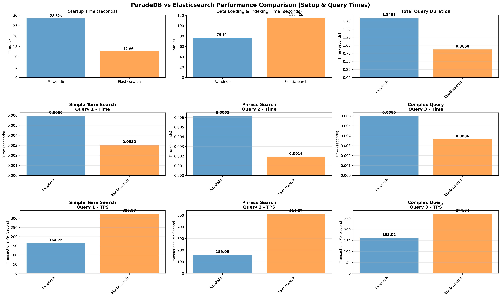
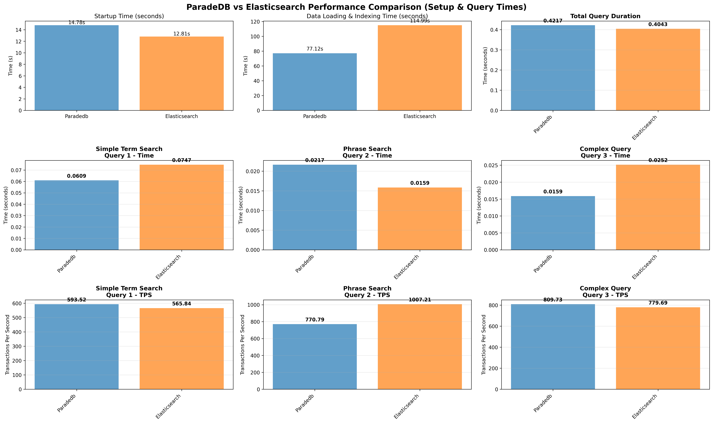

# ParadeDB vs Elasticsearch: Performance Benchmark Analysis

This project benchmarks the full-text search performance of **ParadeDB** (PostgreSQL-based) against **Elasticsearch**. The goal is to understand the performance characteristics, trade-offs, and scalability of each solution under controlled conditions.

## 📊 Executive Summary

Based on the latest benchmark runs, we observed distinct performance profiles for each system:

*   **Large Datasets (1M documents)**: **ParadeDB** showed faster indexing times (~77s vs ~115s) compared to Elasticsearch. However, **Elasticsearch** maintained higher query throughput (TPS) across all concurrency levels, though ParadeDB narrowed the gap significantly at 10 concurrent clients.
*   **Storage Efficiency**: Elasticsearch consistently used significantly less disk space (~500MB) compared to ParadeDB (~2GB) for the large dataset.
*   **Operational Overhead**: Elasticsearch consistently showed faster startup times, while ParadeDB (running as a PG extension) required slightly more time to become ready.

## 📈 Detailed Results

### 1. Large Dataset Performance (1,000,000 Documents) & Concurrency Analysis

For the large dataset, we tested performance across three different concurrency levels (1, 10, and 100 clients) to understand how each system scales under load.

#### Performance Comparison by Concurrency

| Metric | 1 Client (PG vs ES) | 10 Clients (PG vs ES) | 100 Clients (PG vs ES) |
| :--- | :--- | :--- | :--- |
| **Avg Throughput (TPS)** | 162 vs **372** | 788 vs **799** | 725 vs **784** |
| **Indexing Time** | **76.4s** vs 115.4s | **77.1s** vs 114.3s | **77.1s** vs 115.0s |
| **Database Size** | ~1.97 GB vs **~0.51 GB** | ~1.97 GB vs **~0.51 GB** | ~1.97 GB vs **~0.51 GB** |
| **Startup Time** | 28.8s vs **12.9s** | 16.5s vs **12.8s** | 14.8s vs **12.8s** |

#### Key Findings

*   **Indexing Speed**: ParadeDB was consistently faster at indexing 1 million documents (~77s) compared to Elasticsearch (~115s). This reverses the trend seen at the medium scale.
*   **Throughput (TPS)**: Elasticsearch maintained a lead in throughput across all concurrency levels.
    *   **1 Client**: Elasticsearch was ~2.3x faster.
    *   **10 Clients**: The gap narrowed significantly, with ParadeDB reaching near parity (788 TPS vs 799 TPS).
    *   **100 Clients**: Elasticsearch widened the gap slightly again, but both systems held up well.
*   **Storage**: ParadeDB's storage footprint (~2GB) was roughly 4x larger than Elasticsearch's (~500MB) for the same dataset. This is because ParadeDB stores the full raw text data in PostgreSQL tables plus search indexes, while Elasticsearch only maintains compressed inverted indexes optimized for search queries.

#### Visualizations

**1 Client Performance**


**10 Clients Performance**


**100 Clients Performance**


---

## 🔬 Methodology

The benchmarks were conducted using a containerized environment to ensure isolation and reproducibility.

*   **Environment**: Docker containers for both databases.
*   **Resources**: Both systems were restricted to identical CPU and Memory limits (configurable in `config/benchmark_config.json`) to ensure a fair fight.
*   **Data Storage Differences**: 
    *   **ParadeDB**: Stores full raw text data in PostgreSQL tables (title and content columns) plus creates BM25 search indexes, resulting in larger storage footprint.
    *   **Elasticsearch**: Only maintains compressed inverted indexes and tokenized data optimized for search, resulting in more efficient storage.
*   **Workload**:
    *   **Ingestion**: Bulk loading of JSON documents.
    *   **Queries**: A mix of Simple Term, Exact Phrase, and Complex Boolean queries.
    *   **Concurrency**: 4 concurrent workers executing 100 transactions each.

## 🛠️ How to Reproduce

To run these benchmarks yourself and verify the results:

1.  **Prerequisites**: Docker and Python 3.
2.  **Install Dependencies**: `pip install -r requirements.txt`
3.  **Run Benchmark**:
    ```bash
    # Run Large scale benchmark
    ./run_tests.sh -s large
    ```
4.  **View Results**:
    *   Summaries are generated in `plots_1client/`, `plots_10clients/`, and `plots_100clients/`.
    *   Raw timing logs are in `results_1client/`, `results_10clients/`, and `results_100clients/`.
    *   Configuration can be tweaked in `config/benchmark_config.json`.

