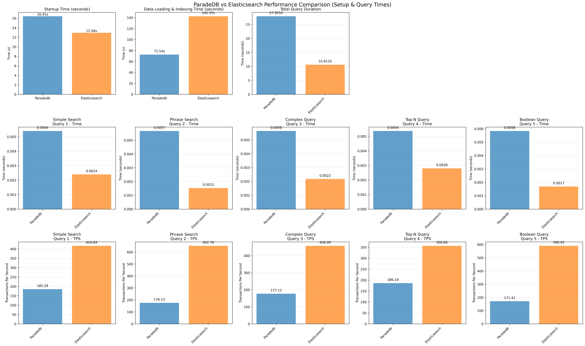
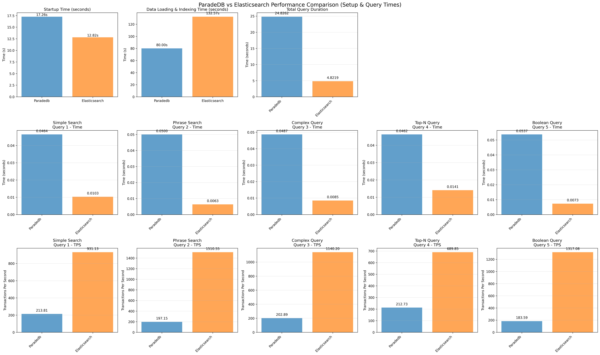

# ParadeDB vs Elasticsearch: Performance Benchmark Analysis

This project benchmarks the full-text search performance of **ParadeDB** (PostgreSQL-based) against **Elasticsearch**. The goal is to understand the performance characteristics, trade-offs, and scalability of each solution under controlled conditions.

## 📊 Executive Summary

Based on the latest benchmark runs, we observed distinct performance profiles for each system:

*   **Large Datasets (1M documents)**: **Elasticsearch** dominated query throughput (TPS) at both 1 and 10 concurrent clients.
*   **Storage Efficiency**: Elasticsearch was generally more storage efficient (~1GB in 10-client run) compared to ParadeDB (~1.9GB).
*   **Operational Overhead**: Elasticsearch consistently showed faster startup times (~13s vs ~17s), but ParadeDB was significantly faster at indexing (~72-80s vs ~132-142s).

## 📈 Detailed Results

### 1. Large Dataset Performance (1,000,000 Documents) & Concurrency Analysis

For the large dataset, we tested performance across two different concurrency levels (1 and 10 clients) to understand how each system scales under load.

#### Performance Comparison by Concurrency

*Note: These results are based on 1,000 transactions per query type.*

| Metric | 1 Client (PG vs ES) | 10 Clients (PG vs ES) |
| :--- | :--- | :--- |
| **Avg Throughput (TPS)** | 179 vs **495** | 202 vs **1118** |
| **Indexing Time** | **72.5s** vs 142.6s | **80.0s** vs 132.6s |
| **Database Size** | ~1.90 GB vs ~3.01 GB | ~1.90 GB vs **~1.00 GB** |
| **Startup Time** | 16.4s vs **12.9s** | 17.3s vs **12.8s** |

#### Key Findings

*   **Indexing Speed**: ParadeDB was consistently faster at indexing 1 million documents (~72-80s) compared to Elasticsearch (~132-142s).
*   **Throughput (TPS)**:
    *   **1 Client**: Elasticsearch was ~2.7x faster (495 TPS vs 179 TPS).
    *   **10 Clients**: Elasticsearch maintained a significant lead (1118 TPS vs 202 TPS).
*   **Storage**: ParadeDB's storage footprint was consistent at ~1.90GB. Elasticsearch showed variability, ranging from ~1.00GB (10 clients) to ~3.01GB (1 client).
*   **Resource Usage**: ParadeDB used less memory (~2.7GB) compared to Elasticsearch (~4.7-5.1GB) under load.

#### Visualizations

*(See "Workload" section for details on Query 1-5)*

**1 Client Performance**



**10 Clients Performance**



---

## 🔬 Methodology

The benchmarks were conducted using a containerized environment to ensure isolation and reproducibility.

*   **Hardware**: MacBook Pro M1.
*   **Environment**: Local Kubernetes cluster running in Docker (configured with 8 CPUs and 12GB RAM).
*   **Software Versions**:
    *   Docker: 29.1.3
    *   Kubernetes Client: v1.34.1
    *   Python: 3.10.15
    *   Elasticsearch: 8.11.0
    *   ParadeDB: latest
*   **Resources**: Both systems were restricted to identical CPU and Memory limits (4 CPU, 8GB RAM, configurable in `config/benchmark_config.json`) to ensure a fair fight.
*   **Data Storage Differences**: 
    *   **ParadeDB**: Stores full raw text data in PostgreSQL tables (title and content columns) plus creates BM25 search indexes, resulting in larger storage footprint.
    *   **Elasticsearch**: Only maintains compressed inverted indexes and tokenized data optimized for search, resulting in more efficient storage.
*   **Workload**:
    *   **Ingestion**: Bulk loading of JSON documents.
    *   **Queries**: The benchmark executes a mix of 5 distinct query types to simulate real-world usage patterns:
        1.  **Query 1 (Simple Search)**: Single-term full-text search (e.g., "strategy", "innovation"). Tests basic inverted index lookup speed.
        2.  **Query 2 (Phrase Search)**: Exact phrase matching (e.g., "project management"). Tests position-aware index performance.
        3.  **Query 3 (Complex Query)**: Intersection of two distinct terms (e.g., "global" AND "initiative"). Tests boolean AND logic efficiency.
        4.  **Query 4 (Top-N Query)**: Single-term search with a limit on results (N=50). Tests ranking and retrieval optimization for paginated views.
        5.  **Query 5 (Boolean Query)**: A complex combination of MUST, SHOULD, and NOT clauses (e.g., MUST contain "strategy", SHOULD contain "growth", MUST NOT contain "risk"). Tests the query engine's ability to handle complex logic and filtering.
    *   **Concurrency**: Tests were run with 1 and 10 concurrent clients to evaluate scalability.

### Metric Definitions and Calculations

The benchmark measures several key performance metrics:

*   **Iterations (Transactions)**: The total number of queries executed for each query type. This represents the workload volume.
*   **Concurrency**: The number of simultaneous client threads executing queries in parallel. Higher concurrency simulates more users.
*   **Average Query Latency**: The average time taken per individual query, calculated as the total execution time across all workers divided by the total number of transactions. This metric represents the response time experienced by clients.
*   **TPS (Transactions Per Second)**: The throughput metric, calculated as total transactions divided by the wall time. This shows how many queries the system can process per second under the given concurrency.
*   **Wall Time**: The total elapsed time from the start to the end of the benchmark run for a specific query type and concurrency level.

**Relationships and Computations**:
- TPS = Total Transactions / Wall Time
- Average Latency = (Sum of individual worker execution times) / Total Transactions
- Wall Time is measured across concurrent execution, so it represents the time until the last worker completes
- Higher concurrency typically reduces wall time but may increase average latency due to resource contention
- Iterations determine the statistical significance; more iterations provide more reliable average latency measurements

*   **Data Generation**:
    *   Synthetic data is generated using real English words (sourced from `dwyl/english-words`) to ensure realistic term frequency and distribution, rather than random character strings.
    *   Documents simulate business reports with fields like `title`, `description`, `category`, etc.

*   **Client Implementation**:
    *   **ParadeDB**: Uses `psycopg2` with `ThreadedConnectionPool` to efficiently manage database connections across concurrent threads.
    *   **Elasticsearch**: Uses Python `requests` with `HTTPAdapter` to enable connection pooling and automatic retries, ensuring optimal HTTP performance.
    *   **Concurrency Model**: Both benchmarks utilize Python's `ThreadPoolExecutor` to spawn concurrent worker threads, simulating real-world parallel user requests.

*   **Resource Monitoring**:
    *   Real-time resource usage (CPU & Memory) is captured using `docker stats` (since `kubectl top` was not available in the local environment) to ensure accurate measurement of container overhead.

## 📂 Project Structure

```
├── config/                 # Benchmark configuration
├── data/                   # Generated synthetic data
├── k8s/                    # Kubernetes deployment manifests
├── plots/                  # Generated performance plots and summaries
├── results/                # Raw benchmark results (JSON, CSV)
├── scripts/                # Python scripts for benchmarking and monitoring
├── generate_plots.py       # Plot generation script
├── run_tests.sh            # Main benchmark runner script
└── requirements.txt        # Python dependencies
```

## 🛠️ How to Reproduce

To run these benchmarks yourself and verify the results:

1.  **Prerequisites**: Docker and Python 3.
2.  **Install Dependencies**: `pip install -r requirements.txt`
3.  **Run Benchmark**:
    ```bash
    # Run Large scale benchmark
    ./run_tests.sh -s large
    ```
4.  **View Results**:
    *   Summaries and plots are generated in the `plots/` directory.
    *   Raw timing logs and resource usage data are in the `results/` directory.
    *   **Query Plans**: For ParadeDB, `EXPLAIN ANALYZE` output for each query type is saved to `results/explain_analyze_query_X.txt` to assist with performance debugging.
    *   Configuration can be tweaked in `config/benchmark_config.json`.

### Advanced Usage

The `run_tests.sh` script supports several flags to customize the benchmark run:

| Flag | Description | Default |
| :--- | :--- | :--- |
| `-s, --scale` | Data scale (`small`, `medium`, `large`) | `small` |
| `-c, --concurrency` | Number of concurrent clients | From config |
| `-t, --transactions` | Number of transactions per query type | From config |
| `--cpu` | CPU limit for databases (e.g., `4`, `1000m`) | From config |
| `--mem` | Memory limit for databases (e.g., `8Gi`, `4GB`) | From config |
| `-d, --databases` | Specific databases to run (`paradedb`, `elasticsearch`) | Both |

**Examples:**

```bash
# Run with custom concurrency and transaction count
./run_tests.sh -s medium -c 50 -t 500

# Benchmark only ParadeDB with specific resource limits
./run_tests.sh -d paradedb --cpu 2 --mem 4Gi
```

## ⚙️ Configuration

The benchmark is highly configurable via `config/benchmark_config.json`. Key sections include:

*   **`benchmark`**: Global defaults for concurrency and transaction counts.
*   **`data`**: Defines the number of documents for `small`, `medium`, and `large` scales.
*   **`resources`**: (Used by the runner) Defines default CPU/Memory requests and limits for the Kubernetes deployments.
*   **`queries`**: Defines the specific terms used for each query type. You can modify the lists of terms (e.g., `simple.terms`, `complex.term1s`) to change the search corpus.

## ⚠️ Limitations & Future Work

*   **Read-Heavy Focus**: This benchmark primarily focuses on search performance (read latency and throughput). While ingestion time is measured, high-throughput ingestion scenarios (updates, deletes) are not currently covered.
*   **Single Node**: The current setup deploys single-node instances of both ParadeDB and Elasticsearch. Distributed cluster performance and high-availability scenarios are not tested.
*   **Cold vs. Warm Cache**: The benchmark runs queries in sequence. While multiple iterations are performed, explicit controls for cold vs. warm cache testing are not strictly enforced, though the "warm-up" effect is naturally captured in the average latency over many transactions.

