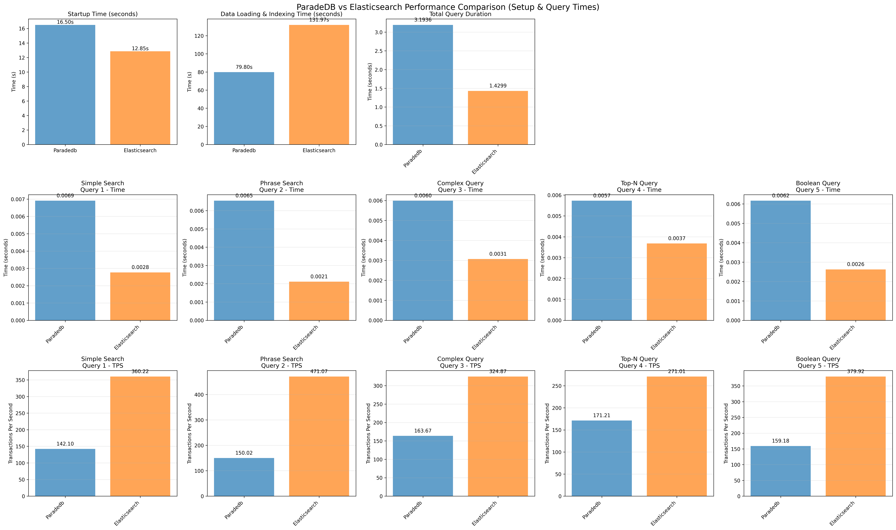
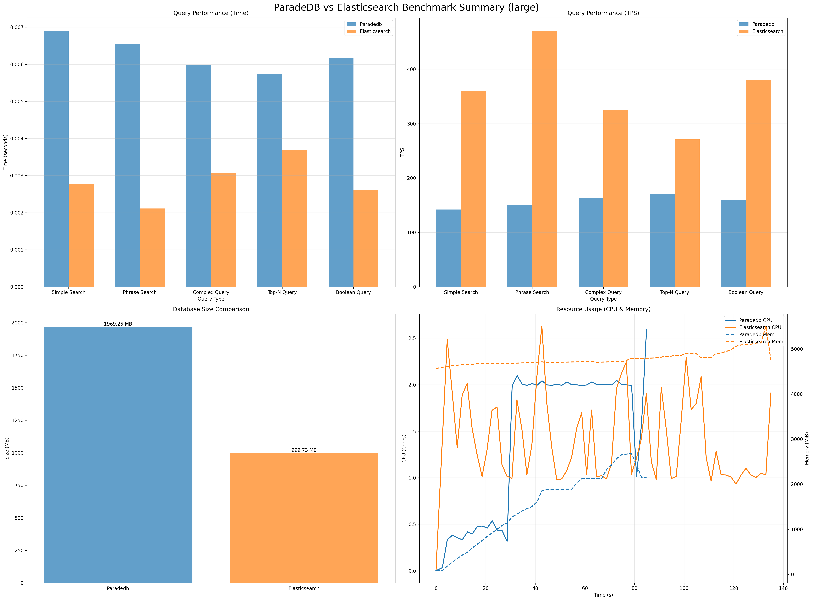
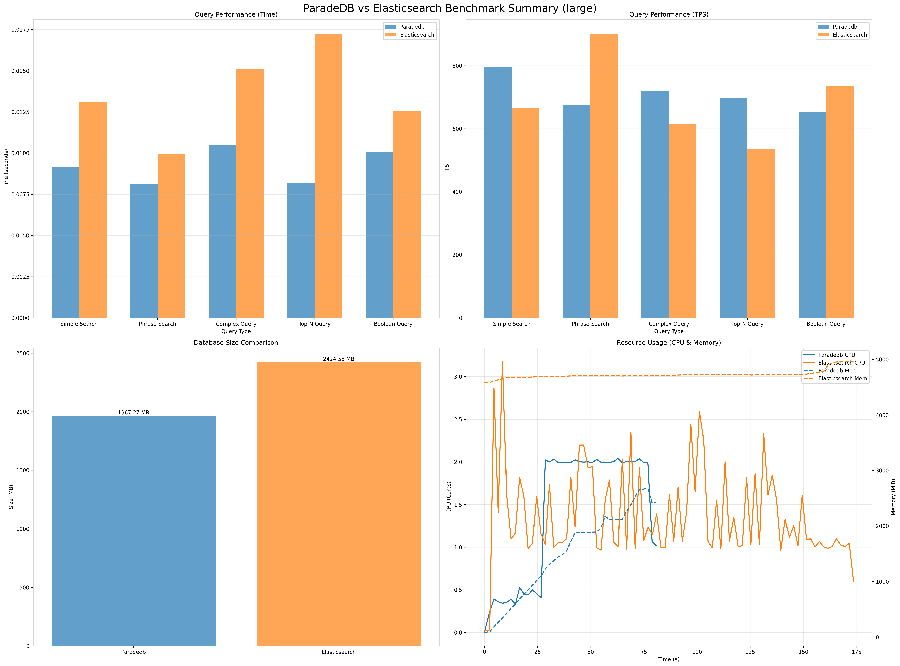
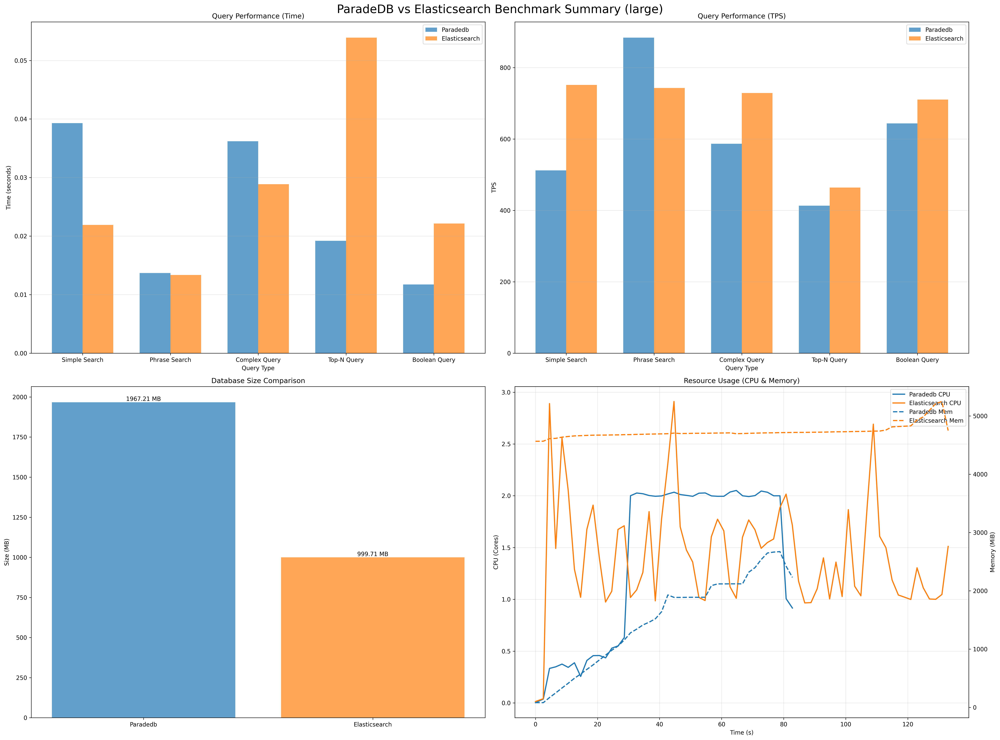

# ParadeDB vs Elasticsearch: Performance Benchmark Analysis

This project benchmarks the full-text search performance of **ParadeDB** (PostgreSQL-based) against **Elasticsearch**. The goal is to understand the performance characteristics, trade-offs, and scalability of each solution under controlled conditions.

## 📊 Executive Summary

Based on the latest benchmark runs, we observed distinct performance profiles for each system:

*   **Large Datasets (1M documents)**: **Elasticsearch** maintained higher query throughput (TPS) at 1 and 100 concurrent clients, but **ParadeDB** outperformed Elasticsearch at 10 concurrent clients.
*   **Storage Efficiency**: Elasticsearch generally used less disk space (~1GB) compared to ParadeDB (~2GB) for the large dataset, though one run showed higher usage for Elasticsearch likely due to pending merges.
*   **Operational Overhead**: Elasticsearch consistently showed faster startup times, while ParadeDB (running as a PG extension) required slightly more time to become ready.

## 📈 Detailed Results

### 1. Large Dataset Performance (1,000,000 Documents) & Concurrency Analysis

For the large dataset, we tested performance across three different concurrency levels (1, 10, and 100 clients) to understand how each system scales under load.

#### Performance Comparison by Concurrency

| Metric | 1 Client (PG vs ES) | 10 Clients (PG vs ES) | 100 Clients (PG vs ES) |
| :--- | :--- | :--- | :--- |
| **Avg Throughput (TPS)** | 157 vs **361** | **708** vs 691 | 608 vs **680** |
| **Indexing Time** | **79.8s** vs 132.0s | **78.4s** vs 171.2s | **79.5s** vs 130.1s |
| **Database Size** | ~1.97 GB vs **~1.00 GB** | ~1.97 GB vs ~2.42 GB | ~1.97 GB vs **~1.00 GB** |
| **Startup Time** | 16.5s vs **12.9s** | 15.0s vs **14.0s** | 14.2s vs **12.8s** |

#### Key Findings

*   **Indexing Speed**: ParadeDB was consistently faster at indexing 1 million documents (~80s) compared to Elasticsearch (~130-170s).
*   **Throughput (TPS)**:
    *   **1 Client**: Elasticsearch was ~2.3x faster.
    *   **10 Clients**: ParadeDB overtook Elasticsearch, achieving slightly higher throughput (708 TPS vs 691 TPS).
    *   **100 Clients**: Elasticsearch regained the lead (680 TPS vs 608 TPS), but both systems remained competitive.
*   **Storage**: ParadeDB's storage footprint (~2GB) was generally larger than Elasticsearch's (~1GB). ParadeDB stores the full raw text data in PostgreSQL tables plus search indexes, while Elasticsearch maintains compressed inverted indexes. Note: The 10-client Elasticsearch run showed larger size (~2.4GB), likely due to unmerged segments at the time of measurement.

#### Visualizations

**1 Client Performance**



**10 Clients Performance**



**100 Clients Performance**



---

## 🔬 Methodology

The benchmarks were conducted using a containerized environment to ensure isolation and reproducibility.

*   **Hardware**: MacBook Pro M1.
*   **Environment**: Local Kubernetes cluster running in Docker (configured with 8 CPUs and 12GB RAM).
*   **Software Versions**:
    *   Docker: 29.1.3
    *   Kubernetes Client: v1.34.1
    *   Python: 3.10.15
    *   Elasticsearch: 8.11.0
    *   ParadeDB: latest
*   **Resources**: Both systems were restricted to identical CPU and Memory limits (4 CPU, 8GB RAM, configurable in `config/benchmark_config.json`) to ensure a fair fight.
*   **Data Storage Differences**: 
    *   **ParadeDB**: Stores full raw text data in PostgreSQL tables (title and content columns) plus creates BM25 search indexes, resulting in larger storage footprint.
    *   **Elasticsearch**: Only maintains compressed inverted indexes and tokenized data optimized for search, resulting in more efficient storage.
*   **Workload**:
    *   **Ingestion**: Bulk loading of JSON documents.
    *   **Queries**: The benchmark executes a mix of 5 distinct query types to simulate real-world usage patterns:
        1.  **Simple Search**: Single-term full-text search (e.g., "strategy", "innovation"). Tests basic inverted index lookup speed.
        2.  **Phrase Search**: Exact phrase matching (e.g., "project management"). Tests position-aware index performance.
        3.  **Complex Query**: Intersection of two distinct terms (e.g., "global" AND "initiative"). Tests boolean AND logic efficiency.
        4.  **Top-N Query**: Single-term search with a limit on results (N=50). Tests ranking and retrieval optimization for paginated views.
        5.  **Boolean Query**: A complex combination of MUST, SHOULD, and NOT clauses (e.g., MUST contain "strategy", SHOULD contain "growth", MUST NOT contain "risk"). Tests the query engine's ability to handle complex logic and filtering.
    *   **Concurrency**: Tests were run with 1, 10, and 100 concurrent clients to evaluate scalability.

## 🛠️ How to Reproduce

To run these benchmarks yourself and verify the results:

1.  **Prerequisites**: Docker and Python 3.
2.  **Install Dependencies**: `pip install -r requirements.txt`
3.  **Run Benchmark**:
    ```bash
    # Run Large scale benchmark
    ./run_tests.sh -s large
    ```
4.  **View Results**:
    *   Summaries are generated in `plots_1clients/`, `plots_10clients/`, and `plots_100clients/`.
    *   Raw timing logs are in `results_1clients/`, `results_10clients/`, and `results_100clients/`.
    *   Configuration can be tweaked in `config/benchmark_config.json`.

