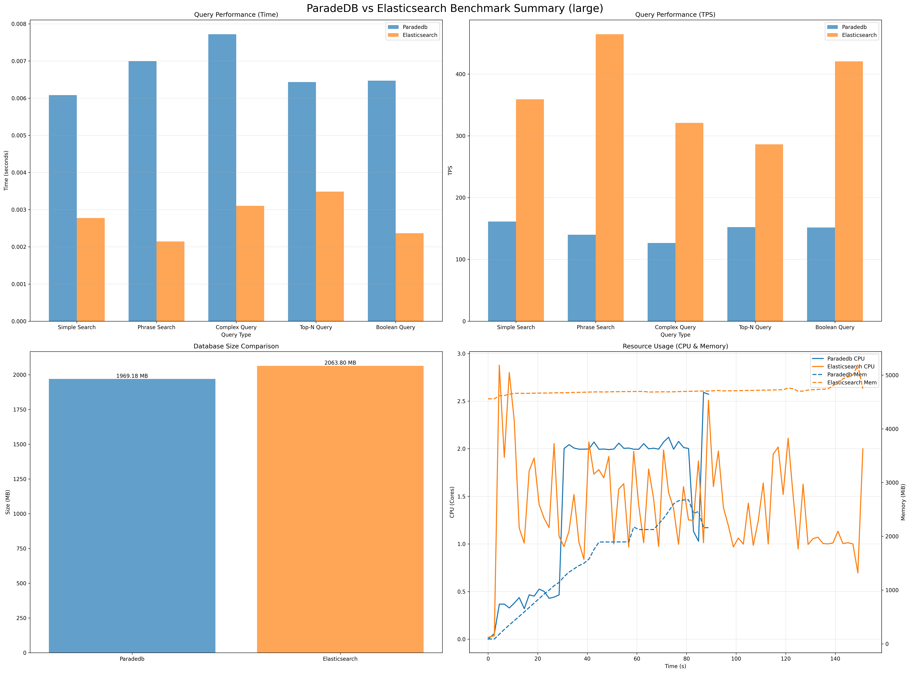
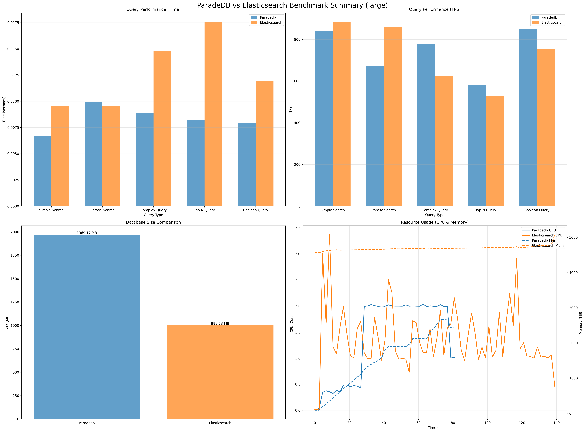
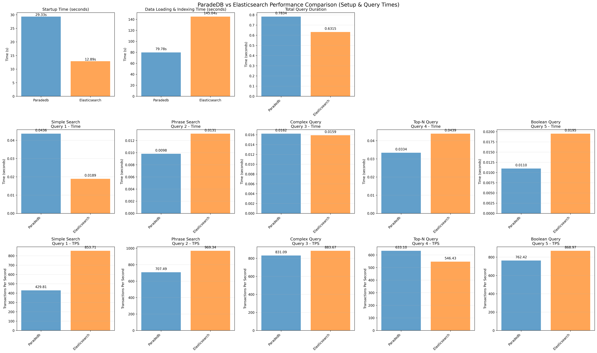
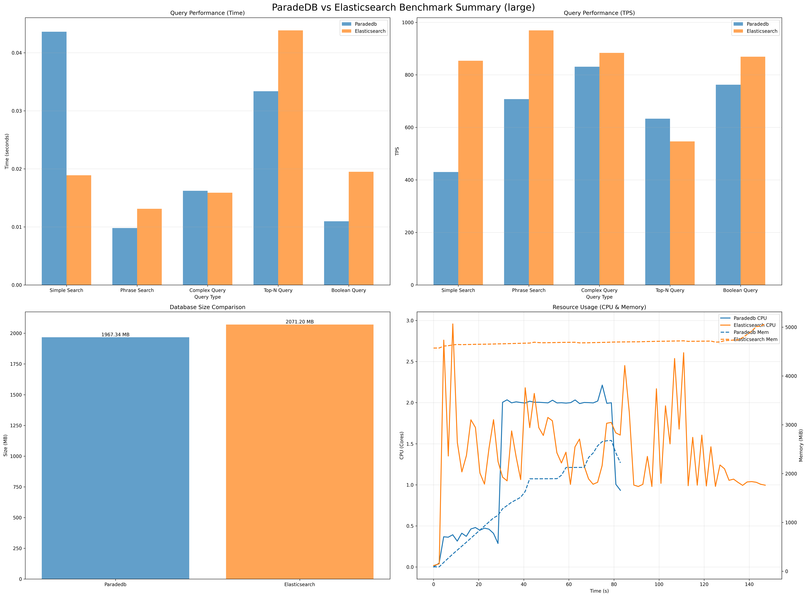

# ParadeDB vs Elasticsearch: Performance Benchmark Analysis

This project benchmarks the full-text search performance of **ParadeDB** (PostgreSQL-based) against **Elasticsearch**. The goal is to understand the performance characteristics, trade-offs, and scalability of each solution under controlled conditions.

## 📊 Executive Summary

Based on the latest benchmark runs, we observed distinct performance profiles for each system:

*   **Large Datasets (1M documents)**: **Elasticsearch** maintained higher query throughput (TPS) at 1 and 100 concurrent clients, but **ParadeDB** outperformed Elasticsearch at 10 concurrent clients.
*   **Storage Efficiency**: Elasticsearch storage usage varied between ~1GB and ~2GB depending on segment merging, while ParadeDB consistently used ~2GB.
*   **Operational Overhead**: Elasticsearch consistently showed faster startup times, while ParadeDB (running as a PG extension) required slightly more time to become ready.

## 📈 Detailed Results

### 1. Large Dataset Performance (1,000,000 Documents) & Concurrency Analysis

For the large dataset, we tested performance across three different concurrency levels (1, 10, and 100 clients) to understand how each system scales under load.

#### Performance Comparison by Concurrency

| Metric | 1 Client (PG vs ES) | 10 Clients (PG vs ES) | 100 Clients (PG vs ES) |
| :--- | :--- | :--- | :--- |
| **Avg Throughput (TPS)** | 146 vs **370** | **744** vs 731 | 673 vs **824** |
| **Indexing Time** | **82.0s** vs 146.7s | **78.3s** vs 137.2s | **79.8s** vs 145.0s |
| **Database Size** | ~1.97 GB vs ~2.06 GB | ~1.97 GB vs **~1.00 GB** | ~1.97 GB vs ~2.07 GB |
| **Startup Time** | 16.8s vs **12.9s** | 15.3s vs **12.9s** | 29.3s vs **12.9s** |

#### Key Findings

*   **Indexing Speed**: ParadeDB was consistently faster at indexing 1 million documents (~80s) compared to Elasticsearch (~137-147s).
*   **Throughput (TPS)**:
    *   **1 Client**: Elasticsearch was ~2.5x faster.
    *   **10 Clients**: ParadeDB overtook Elasticsearch, achieving slightly higher throughput (744 TPS vs 731 TPS).
    *   **100 Clients**: Elasticsearch regained the lead (824 TPS vs 673 TPS), but both systems remained competitive.
*   **Storage**: ParadeDB's storage footprint was consistent at ~2GB. Elasticsearch's storage footprint varied between ~1GB and ~2GB, likely depending on whether background segment merging had completed.

#### Visualizations

**1 Client Performance**



**10 Clients Performance**



**100 Clients Performance**



---

## 🔬 Methodology

The benchmarks were conducted using a containerized environment to ensure isolation and reproducibility.

*   **Hardware**: MacBook Pro M1.
*   **Environment**: Local Kubernetes cluster running in Docker (configured with 8 CPUs and 12GB RAM).
*   **Software Versions**:
    *   Docker: 29.1.3
    *   Kubernetes Client: v1.34.1
    *   Python: 3.10.15
    *   Elasticsearch: 8.11.0
    *   ParadeDB: latest
*   **Resources**: Both systems were restricted to identical CPU and Memory limits (4 CPU, 8GB RAM, configurable in `config/benchmark_config.json`) to ensure a fair fight.
*   **Data Storage Differences**: 
    *   **ParadeDB**: Stores full raw text data in PostgreSQL tables (title and content columns) plus creates BM25 search indexes, resulting in larger storage footprint.
    *   **Elasticsearch**: Only maintains compressed inverted indexes and tokenized data optimized for search, resulting in more efficient storage.
*   **Workload**:
    *   **Ingestion**: Bulk loading of JSON documents.
    *   **Queries**: The benchmark executes a mix of 5 distinct query types to simulate real-world usage patterns:
        1.  **Simple Search**: Single-term full-text search (e.g., "strategy", "innovation"). Tests basic inverted index lookup speed.
        2.  **Phrase Search**: Exact phrase matching (e.g., "project management"). Tests position-aware index performance.
        3.  **Complex Query**: Intersection of two distinct terms (e.g., "global" AND "initiative"). Tests boolean AND logic efficiency.
        4.  **Top-N Query**: Single-term search with a limit on results (N=50). Tests ranking and retrieval optimization for paginated views.
        5.  **Boolean Query**: A complex combination of MUST, SHOULD, and NOT clauses (e.g., MUST contain "strategy", SHOULD contain "growth", MUST NOT contain "risk"). Tests the query engine's ability to handle complex logic and filtering.
    *   **Concurrency**: Tests were run with 1, 10, and 100 concurrent clients to evaluate scalability.

### Metric Definitions and Calculations

The benchmark measures several key performance metrics:

*   **Iterations (Transactions)**: The total number of queries executed for each query type. This represents the workload volume.
*   **Concurrency**: The number of simultaneous client threads executing queries in parallel. Higher concurrency simulates more users.
*   **Average Query Latency**: The average time taken per individual query, calculated as the total execution time across all workers divided by the total number of transactions. This metric represents the response time experienced by clients.
*   **TPS (Transactions Per Second)**: The throughput metric, calculated as total transactions divided by the wall time. This shows how many queries the system can process per second under the given concurrency.
*   **Wall Time**: The total elapsed time from the start to the end of the benchmark run for a specific query type and concurrency level.

**Relationships and Computations**:
- TPS = Total Transactions / Wall Time
- Average Latency = (Sum of individual worker execution times) / Total Transactions
- Wall Time is measured across concurrent execution, so it represents the time until the last worker completes
- Higher concurrency typically reduces wall time but may increase average latency due to resource contention
- Iterations determine the statistical significance; more iterations provide more reliable average latency measurements

*   **Data Generation**:
    *   Synthetic data is generated using real English words (sourced from `dwyl/english-words`) to ensure realistic term frequency and distribution, rather than random character strings.
    *   Documents simulate business reports with fields like `title`, `description`, `category`, etc.

*   **Client Implementation**:
    *   **ParadeDB**: Uses `psycopg2` with `ThreadedConnectionPool` to efficiently manage database connections across concurrent threads.
    *   **Elasticsearch**: Uses Python `requests` with `HTTPAdapter` to enable connection pooling and automatic retries, ensuring optimal HTTP performance.
    *   **Concurrency Model**: Both benchmarks utilize Python's `ThreadPoolExecutor` to spawn concurrent worker threads, simulating real-world parallel user requests.

*   **Resource Monitoring**:
    *   Real-time resource usage (CPU & Memory) is captured using `docker stats` (since `kubectl top` was not available in the local environment) to ensure accurate measurement of container overhead.

## 📂 Project Structure

```
├── config/                 # Benchmark configuration
├── data/                   # Generated synthetic data
├── k8s/                    # Kubernetes deployment manifests
├── plots/                  # Generated performance plots and summaries
├── results/                # Raw benchmark results (JSON, CSV)
├── scripts/                # Python scripts for benchmarking and monitoring
├── generate_plots.py       # Plot generation script
├── run_tests.sh            # Main benchmark runner script
└── requirements.txt        # Python dependencies
```

## 🛠️ How to Reproduce

To run these benchmarks yourself and verify the results:

1.  **Prerequisites**: Docker and Python 3.
2.  **Install Dependencies**: `pip install -r requirements.txt`
3.  **Run Benchmark**:
    ```bash
    # Run Large scale benchmark
    ./run_tests.sh -s large
    ```
4.  **View Results**:
    *   Summaries and plots are generated in the `plots/` directory.
    *   Raw timing logs and resource usage data are in the `results/` directory.
    *   Configuration can be tweaked in `config/benchmark_config.json`.

