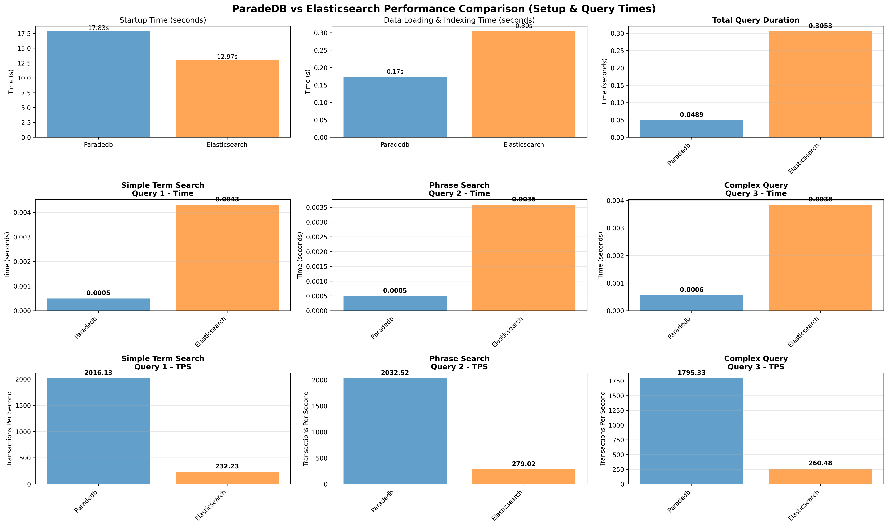
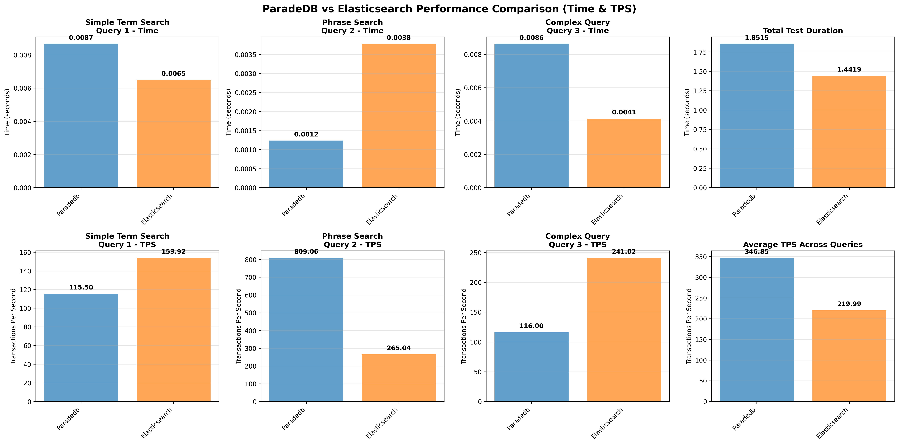

# ParadeDB vs Elasticsearch: Full-Text Search Performance Showdown

## Quick Summary

This benchmark compares ParadeDB and Elasticsearch on full-text search queries across different dataset sizes. Using identical hardware (4 CPU cores, 8GB RAM each) allocated from a MacBook Pro M1 with Docker Engine (8 cores, 12GB RAM total), this tests three query types: simple terms, phrases, and complex boolean searches. The results show some interesting trade-offs that depend on your data scale and query patterns.

## Test Setup

Full-text search is everywhere, but choosing between a dedicated search engine like Elasticsearch and a database-integrated solution like ParadeDB isn't always straightforward. This benchmark helps clarify the performance differences in a real-world setup.

## How This Was Set Up

- **Platform**: macOS MacBook Pro M1 with Docker Engine (8 cores, 12GB RAM total)
- **Load**: 4 concurrent queries, 100 transactions each (with varied search terms)
- **Resources**: Both systems allocated 4 CPU cores and 8GB RAM each (from YAML configs)
- **Elasticsearch JVM**: -Xms4g -Xmx4g heap settings
- **Datasets**: 1K, 100K, and 1M documents
- **Queries**: Simple term search, exact phrase matching, and multi-term boolean queries

## The Results

### Small Dataset (1,000 documents)

ParadeDB absolutely dominates here:

| Query Type | ParadeDB Time | ParadeDB TPS | Elasticsearch Time | Elasticsearch TPS |
|------------|---------------|--------------|-------------------|-------------------|
| Simple Term | 0.0005s | 1,859 | 0.0080s | 124 |
| Phrase | 0.0004s | 2,342 | 0.0041s | 244 |
| Complex | 0.0006s | 1,764 | 0.0053s | 187 |
| **Average** | **0.0005s** | **1,988** | **0.0058s** | **185** |

### Medium Dataset (100,000 documents)

Things get closer, with ParadeDB still holding a slight edge:

| Query Type | ParadeDB Time | ParadeDB TPS | Elasticsearch Time | Elasticsearch TPS |
|------------|---------------|--------------|-------------------|-------------------|
| Simple Term | 0.0056s | 180 | 0.0103s | 97 |
| Phrase | 0.0057s | 174 | 0.0059s | 169 |
| Complex | 0.0069s | 145 | 0.0068s | 147 |
| **Average** | **0.0061s** | **166** | **0.0077s** | **138** |

### Large Dataset (1,000,000 documents)

Elasticsearch pulls ahead overall, but with big variations by query type:

| Query Type | ParadeDB Time | ParadeDB TPS | Elasticsearch Time | Elasticsearch TPS |
|------------|---------------|--------------|-------------------|-------------------|
| Simple Term | 0.0087s | 116 | 0.0065s | 154 |
| Phrase | 0.0012s | 809 | 0.0038s | 265 |
| Complex | 0.0086s | 116 | 0.0041s | 241 |
| **Average** | **0.0062s** | **347** | **0.0048s** | **220** |

## What This Means

### Scale Matters Big Time

- **Small datasets**: ParadeDB is way faster. If you're dealing with <100K documents, it's probably the better choice for simplicity and speed.
- **Medium datasets**: Performance is pretty even. Either system works fine here.
- **Large datasets**: Elasticsearch generally wins on throughput, especially for term and complex queries.

### Query Type Differences

- **Simple searches**: Elasticsearch gets better as data grows, likely due to its optimized inverted indexes.
- **Phrase searches**: ParadeDB is surprisingly fast here, especially at scale. If your users do a lot of exact phrase matching, this could be a big win.
- **Complex queries**: Both handle boolean logic well, but Elasticsearch has a slight edge.

### Why These Patterns?

The crossover around 100K documents makes sense, Elasticsearch's distributed architecture starts paying off when you have enough data to justify the overhead. ParadeDB's PostgreSQL-based approach shines in smaller setups where you don't need all that distributed complexity.

For phrase searches, ParadeDB's ILIKE implementation seems particularly efficient, while Elasticsearch's phrase matching might be more conservative.

## Bottom Line

Neither system is universally better. Here's when to pick each:

- **Go with ParadeDB if**:
  - Your dataset is under 100K documents
  - You need killer phrase search performance
  - You want simpler operations (no separate search cluster to manage)

- **Go with Elasticsearch if**:
  - You're dealing with millions of documents
  - Scale and distributed features are important
  - You need consistent performance across all query types

### Things to Consider Next

- Test with your actual query patterns and data distribution
- Look at indexing time, not just query performance
- Consider operational complexity and costs
- Try hybrid approaches if you need both worlds

Results are from this MacBook Pro M1 setup with Docker Engine (4 cores/8GB RAM allocated per database), your runs may vary with different hardware or configurations.

